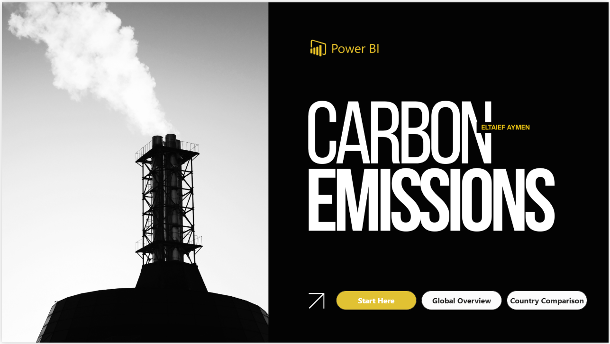
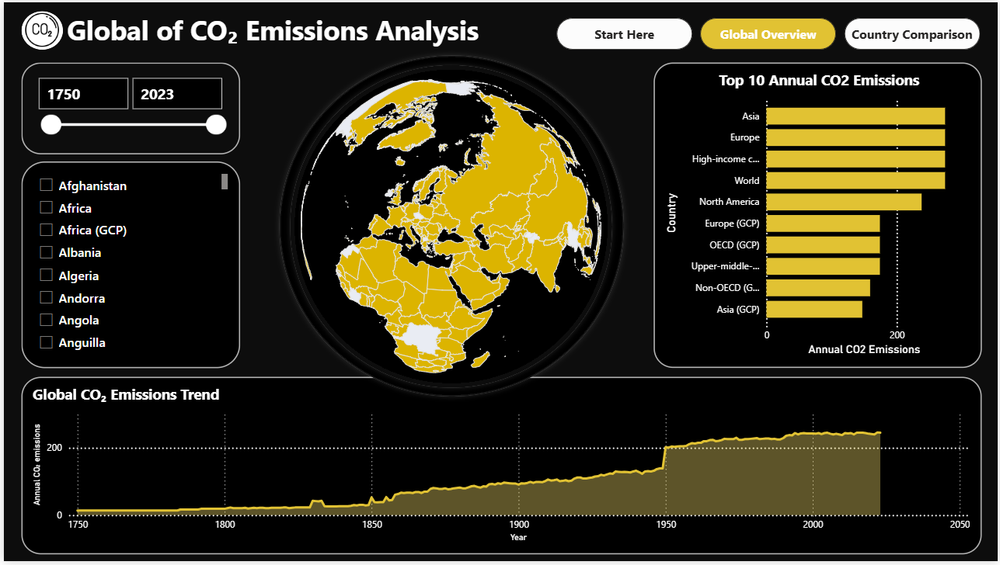

# 🌍 Power BI Project – CO₂ Emissions Analysis

## 📌 Project Overview
This project explores **annual CO₂ emissions per country (1750–2023)** using **Power BI**.  
It demonstrates advanced **data analytics, storytelling, and BI dashboard design**.

The report contains:
1. **Start Page** – modern landing page for intuitive navigation
2. **Global Overview** – world trends, interactive map, Top 10 emitters
3. **Country Comparison** – multi-country analysis with KPIs, ranks, and % of global emissions

## 📊 Dashboards
### Start Page

### Global Overview

### Country Comparison

## 📂 Files
- `CarbonEmissions_Report.pbix` → Power BI file
- `images/` → screenshots of dashboards

## 🎯 Skills Demonstrated
- Power BI (data modeling, DAX, visualization)
- Data storytelling & dashboard design
- Analytical thinking and business intelligence

## 📑 Data Source
Dataset: [Our World in Data – CO₂ and Greenhouse Gas Emissions](https://ourworldindata.org/co2-emissions)

---
⭐ If you like this project, feel free to fork or star this repo!
